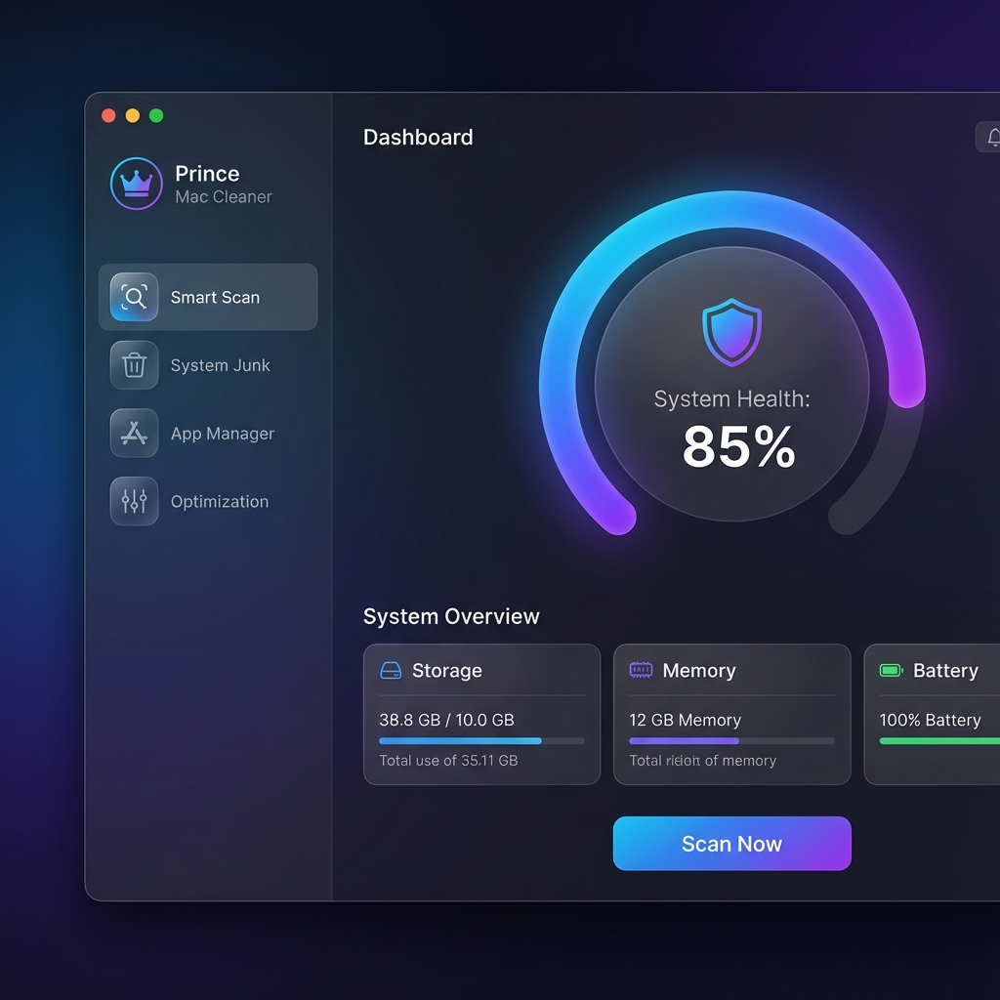
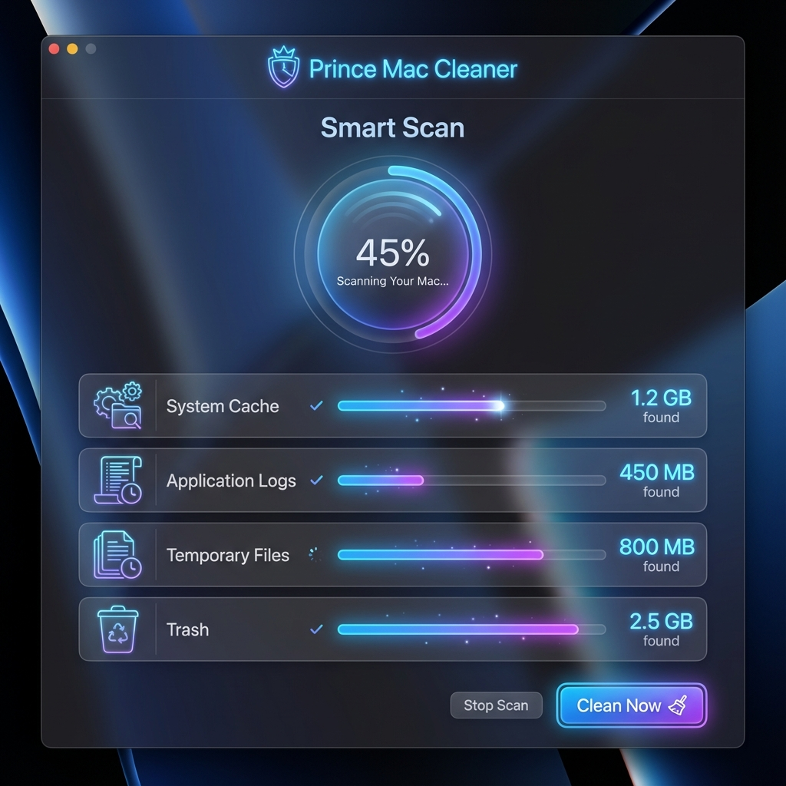

# Prince Mac Cleaner 👑

A premium, high-performance macOS utility app designed to keep your Mac clean, optimized, and fast. Built with **React**, **TypeScript**, **Vite**, and **Electron**.

## Features

- 🚀 **Smart Scan**: Complete system analysis to find health issues and performance bottlenecks.
- 🧹 **System Junk**: Deep cleaning of system cache, application logs, and temporary files.
- 📦 **App Manager**: Easily uninstall unwanted applications and their associated data.
- ⚡ **Optimization**: Real-time memory and system performance optimizations.

## Screenshots

<p align="center">
  
  <br>
  <em>Dashboard - System Health Overview</em>
</p>

<p align="center">
  
  <br>
  <em>Smart Scan - Deep System Cleaning</em>
</p>

## Tech Stack

- **Frontend**: React + TypeScript
- **Styling**: Vanilla CSS (Modern aesthetic with glassmorphism)
- **Runtime**: Electron
- **Build Tool**: Vite

## Getting Started

### Prerequisites

- Node.js (Latest LTS recommended)
- npm or yarn

### Installation

1. Clone the repository:
   ```bash
   git clone https://github.com/PraveenVerma17/PrinceMacCleaner.git
   ```
2. Install dependencies:
   ```bash
   npm install
   ```
3. Start the development server:
   ```bash
   npm run dev
   ```

## License

MIT License - see the [LICENSE](LICENSE) file for details.
